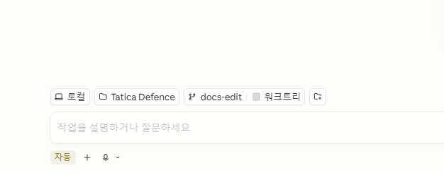

# 작업 워크 플로우

1. 택티카 디펜스 프로젝트를 클로드 코드로 킨다.
   1. 워크트리 체크되어있으면 체크 해제

1. 작업 내용을 작성한다.
2. 클로드 코드한테 작업 내용을 커밋하라고 명령한다
   1. 대답해줘
3. push 해달라고 한다
4. mr 만들어 달라고 해
   1. 링크를 줄 거야
5. 링크 들어서 mr 만들기 눌러()
6. 그리고 나한테 요청해
7. 그럼 병합 끝